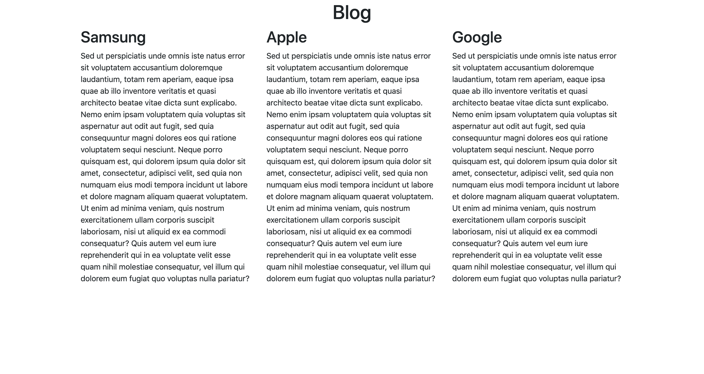

# TP BLOG
- public/index.php : le fichier principal de l'application et la home page
- includes/config.php : le fichier de configuration pour la bdd
- includes/functions.php : le fichier des fonctions principales
- scripts/dbinit.php : le fichier pour initialiser la bdd

## Consignes du TP
- [X] Construiser un projet sur votre environnement local reprenant la même structure que ce repository. Vous devriez obtenir le résultat suivant :

- [X] Appeler votre intervenant (2 points)
- [X] En vous inspirant de cette structure, mettre en place un CRUD :  CREATION / RETRIEVE / UPDATE / DELETE pour les articles de blog.
- [X] Appeler votre intervenant (2 points)
- [X] En vous inspirant de cette structure, mettre en place un CRUD pour les catégories des articles de blog
- [X] Mettre en place un formulaire de connexion
- [X] Mettre en place un système de permissions
- [X] Appeler votre intervenant si vous avez fini

## A rendre
- [X] une url de votre projet github. Les commandes principales de git : "git status" / "git add" / "git commit" / "git push"

# Suite
- [X] Observer la nouvelle structure du code en orienté objet et coder les "todo"
